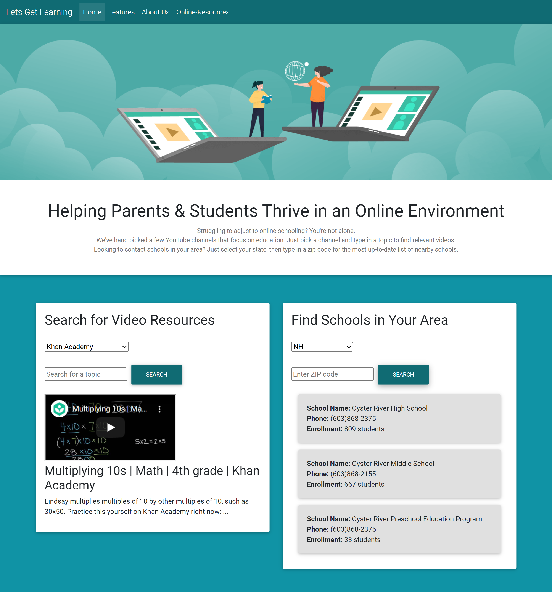

# Remote Education Resource

### _A multi-page website for parents facing the challenges of remote education_

  
Currently deployed at [GitHub Pages](https://dmaysteinman.github.io/project_1/)

---

## Features

- Search for educational resources using Education Data Portal and YouTube Data APIs.

- User selects criteria such as YouTube channels: Khan Academy, Sesame Street, Smithsonian, NOVA PBS, Crash Course, and It's OK to be Smart. 

- User can also search by state and zip code for potential schools in their area.

- An additional resources page for other educational websites to assist with online learning such as Understood.org etc. 

---

## Project Collaborators:

&nbsp;&nbsp;&nbsp;&nbsp;&nbsp;
  

&nbsp;&nbsp;&nbsp;&nbsp;&nbsp;

---

## Reflection

- Searching for APIs to fit specific design was a small obstacle at first. For future projects, we will identify potentially useful APIs **early** and let available resources have a larger influence on the planning/development process.

---

## Future Development

- Integrate calendar feature for user to access assignments/due dates

- Option for user to narrow results by school level/grades offered

- Update YouTube search to display multiple video results or a full playlist

---

  

This project is [MIT](https://github.com/dmaysteinman/project_1/blob/main/LICENSE) licensed  
© 2020 _StopBooleanMe_

